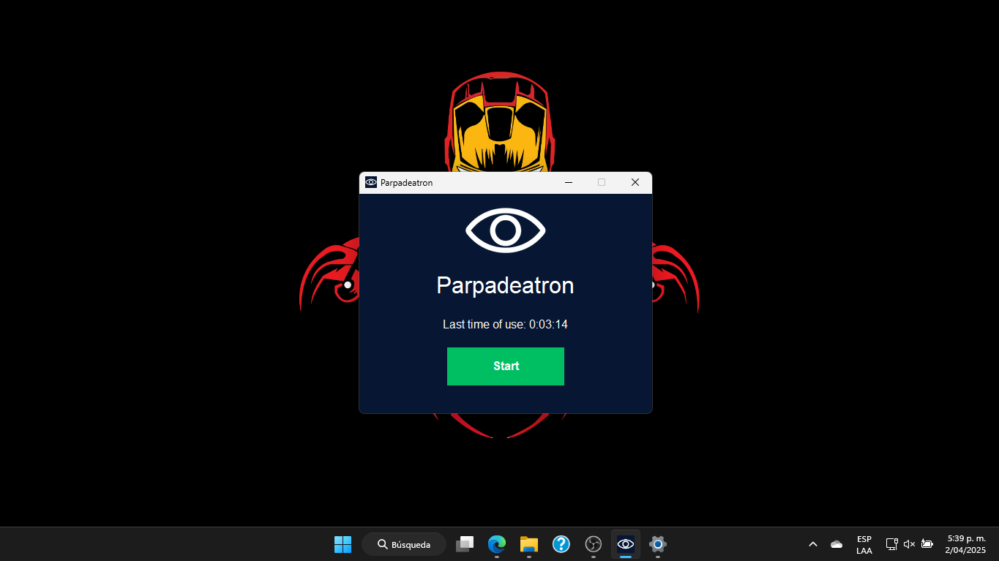
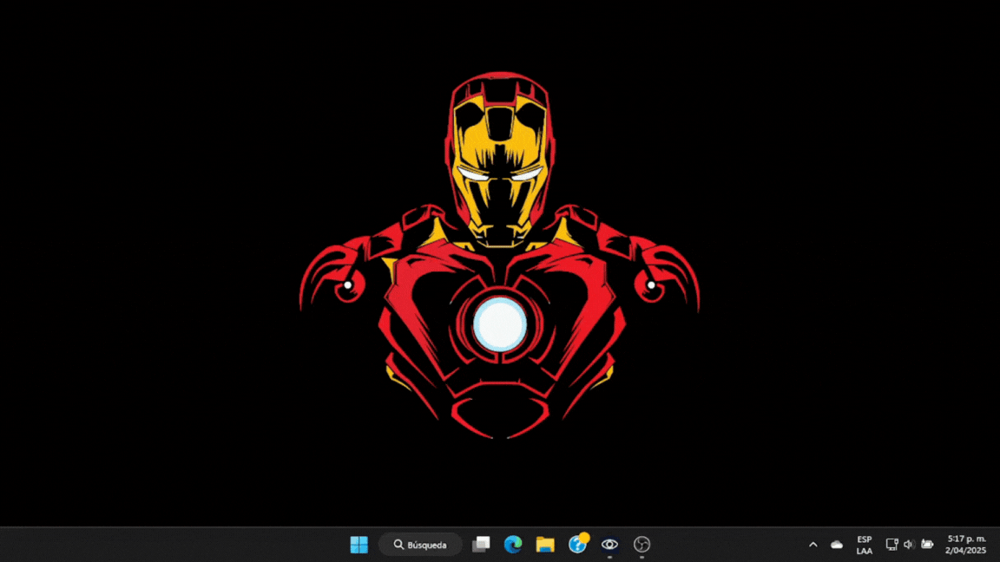

# 

# Parpadeatron-Project

   
<!--Cambiar el color a c90c0f cuando ya no esté en desarrollo-->

## ¿Qué es?
**Parpadeatron** es una innovadora aplicación de escritorio escrita en Python diseñada para abordar un problema de salud visual común en la era digital: la disminución de la frecuencia de parpadeo durante el uso prolongado de pantallas. Esta reducción puede provocar sequedad ocular y otras molestias.
**Parpadeatron** pretende ser una ayuda para mitigar estos efectos al mostrar un recordatorio traslucido periódico en la pantalla para que el usuario parpadee de manera consciente.

## ¿Por qué es importante?
Estudios indican que una persona normal parpadea entre 15 y 20 veces por minuto, pero al estar frente a una pantalla, esta cifra baja a solo entre 5 y 3 veces por minuto [[1][article aao]] [[2][article xataka]] (_pero tu y yo sabemos que eso puede ser incluso menos cuando vemos esa buena peli_). 
Esto provoca, entre otras cosas:
* **Sequedad Ocular:** Menor lubricación en la superficie ocular, lo que puede desencadenar en el síndrome del ojo seco. [[3][article ojo seco]]
* **Fatiga Visual:** El esfuerzo excesivo de los músculos oculares y el dolor de cabeza que esto puede provocar [[4][article clbaviera]] son un cóctel perfecto para estar de mal humor.  
* **Irritación, enrojecimiento, picazón, etc.:** La lista de molestias debido a la falta de humedad adecuada del ojo continúa. 

Pero hay una solución al alcance de todos, la Academia Americana de Oftalmología (y otros autores) recomiendan que, para evitar estos problemas al estar frente a la pantalla, hay que parpadear de manera consciente [[1][article aao]], [[4][article clbaviera]], [[5][article clvilloria]]. Es aquí donde **Parpadeatron** y sus recordatorios pueden serle útiles a los usuarios. 

## Características

- **Recordatorios translúcidos:** Aparecen en la parte inferior central de la pantalla durante tres segundos cada diez segundos, incentivando al usuario a parpadear.
- **Interfaz amigable:** Fácil de activar y desactivar según las necesidades del usuario.
- **Ligero y eficiente:** No interfiere con el rendimiento del sistema.

## Descarga:
Puedes descargar la última versión de **Parpadeatron** desde el siguiente enlace (por ahora, solo está disponible para equipos **Windows**):

O vé a la carpeta "_dist_" de este repositorio y descarga el archivo "_Parpadeatron.exe_".

## Instalación
1. **Descarga** el archivo ejecutable desde el enlace anterior.
2. **Ejecuta** el archivo descargado 
3. **Permite** la ejecución de la aplicación. Antivirus como Windows Defender o Avast pueden evitar su ejecución ya que no viene de una marca conocida, en ese caso, debes seleccionar la opción "_Ejecutar de todas formas_" o añadir una excepción al archivo ejecutable.
4. **Inicia** la aplicación abriendo el ejecutable y presionando "_Start_".

## Agradecimientos

Este proyecto se realizó con el apoyo de:

- **Andrés Esteban Cristancho Gómez**
- **Jhon Frades Laiton Cortes**
- **Juan Manuel Simanca Diaz**

¡Gracias por su colaboración y entusiasmo en el desarrollo de **Parpadeatron**! 

---
>**Nota:**
>
>**Parpadeatron** es distribuido con la esperanza de que sea útil para el usuario, pero no ofrece ninguna garantía. **Parpadeatron no pretende reemplazar ningún tratamiento ni opinión médica u oftalmológica especializada**.

---

## Referencias:

[1] K. Boyd, J. M. Huffman, and D. Turbert, "Las computadoras, los dispositivos digitales y la fatiga ocular," *American Academy of Ophthalmology*, Jun. 27, 2024. [Online]. Available: https://www.aao.org/salud-ocular/consejos/uso-de-la-computadora-y-la-fatiga-visual#:~:text=Normalmente%2C%20los%20humanos%20parpadeamos%20unas,que%20requiere%20en%20su%20superficie

[2] Webedia Brand Services, "¿Parpadeamos menos desde que usamos más la tecnología?," *Xataka*, Mar. 17, 2017. [Online]. Available: https://www.xataka.com/tecnologiazen/parpadeamos-menos-desde-que-usamos-mas-la-tecnologia

[3] Á. R. Vega and L. T. Castro, "Síndrome visual informático: manejo actual basado en la evidencia," *Revista Médica Clínica Las Condes*, vol. 34, no. 5, pp. 315–321, 2023. [Online]. Available: https://www.elsevier.es/es-revista-revista-medica-clinica-las-condes-202-articulo-sindrome-visual-informatico-manejo-actual-S071686402300069X  

[4] Clínica Baviera, "Cómo evitar que la pantalla de tu ordenador dañe tu vista," *Blog De Clínica Baviera*, Apr. 22, 2024. [Online]. Available: https://www.clinicabaviera.com/blog/bye-bye-gafas/evita-las-molestias-en-los-ojos-causados-por-las-pantallas/

[5] Villoria, "Síndrome visual del ordenador. Cómo evitarlo con 4 consejos," *Clínica Villoria*, Feb. 10, 2022. [Online]. Available: https://www.clinicavilloria.es/sindrome-visual-del-ordenador-como-evitarlo-con-4-consejos/
 

_Este archivo `README.md` está escrito en formato Markdown. Para más información sobre cómo dar formato a este tipo de documentos, puedes consultar la [Guía de Markdown](https://www.markdownguide.org/basic-syntax/)._

[article aao]: https://www.aao.org/salud-ocular/consejos/uso-de-la-computadora-y-la-fatiga-visual#:~:text=Normalmente%2C%20los%20humanos%20parpadeamos%20unas,que%20requiere%20en%20su%20superficie

[article xataka]: https://www.xataka.com/tecnologiazen/parpadeamos-menos-desde-que-usamos-mas-la-tecnologia

[article ojo seco]: https://www.elsevier.es/es-revista-revista-medica-clinica-las-condes-202-articulo-sindrome-visual-informatico-manejo-actual-S071686402300069X

[article clbaviera]: https://www.clinicabaviera.com/blog/bye-bye-gafas/evita-las-molestias-en-los-ojos-causados-por-las-pantallas/

[article clvilloria]: https://www.clinicavilloria.es/sindrome-visual-del-ordenador-como-evitarlo-con-4-consejos/ 

